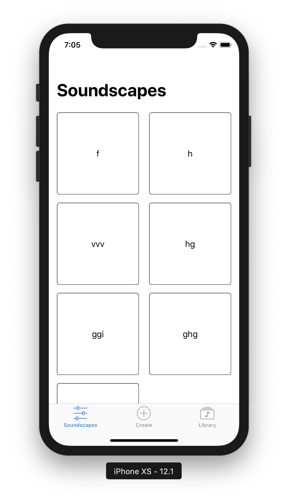

# Soundscape Mixer
>An application for research purpose where users are able to create soundscape

## App's features
- [x]Download audio
- [x]Mix multiple audio
- [x]Record audio
- [x]Stream audio

## Requirements
* iOS 11.0+
* Xcode 10

## Built With
* [Realm Database](https://realm.io/products/realm-database)

## Authors
* Ngoc Doan (ngocdh236@gmail.com)
* Long Nguyen
* Artem Abramov

## License
This project is licensed under the MIT License - see the [LICENSE.md](https://github.com/Metropolia-Soundscape/soundscape-mixer/blob/master/LICENSE.md) file for details
